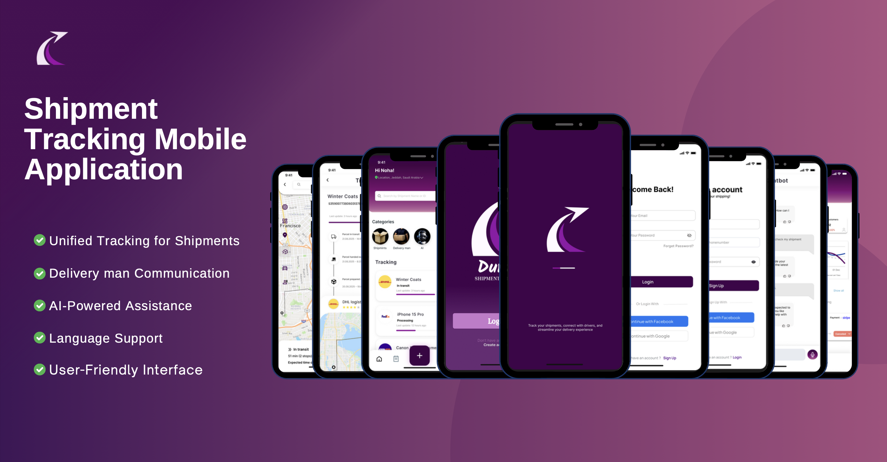
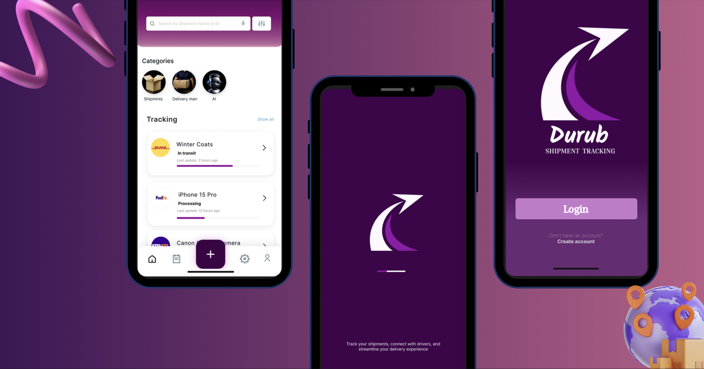
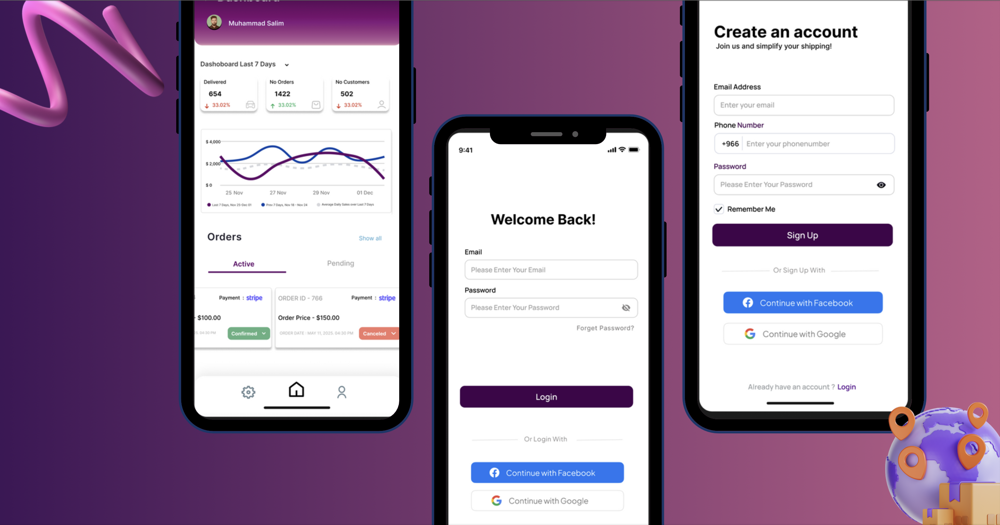
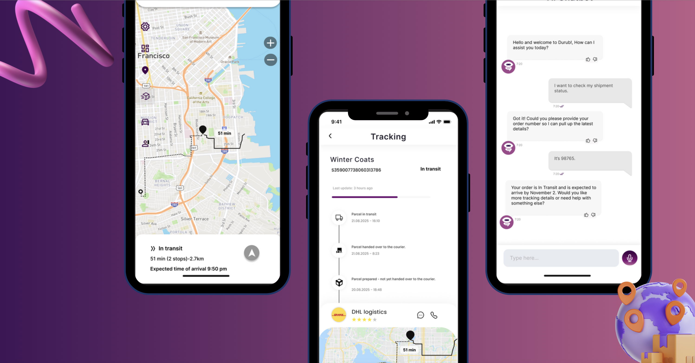

# Durub Application  
*A shipment tracking and delivery communication concept app – Engineering Innovation Club @ KAU*

Durub is a prototype mobile application designed as an innovation project under the **Engineering Innovation Club at King Abdulaziz University**.  
The project focuses on solving the challenge of tracking shipments coming from different delivery companies by creating **one unified platform** that provides real-time tracking, delivery updates, and customer–delivery agent communication.

Durub offers an improved user experience for small business owners and customers by providing accurate shipment tracking, instant updates, and AI-powered assistant support.

---

## ✅ Project Goals

- Provide a **centralized shipment tracking platform** for multiple delivery companies.  
- Enable customers to track shipments using **GPS-based real-time location**.  
- Improve communication between customers and delivery agents through **integrated chat**.  
- Reduce user frustration caused by scattered tracking systems.  
- Provide a simple, fast, user-friendly interface for both customers and delivery drivers.

---

## ✅ Core Features

### 📍 Shipment Tracking  
Track shipment status, location, and updates in real-time using GPS technology.  

### 💬 Customer–Delivery Man Communication  
Integrated messaging to enable customers to communicate directly with the delivery agent.  

### 🤖 AI-Powered Assistant  
AI chatbot that:  
- Answers customer questions  
- Helps track shipments  
- Collects customer feedback  
- Simplifies post-delivery support  

### 🔔 Instant Notifications  
Instant alerts for:  
- Shipment status changes  
- Delivery time updates  
- Any issues or delays  

### 🌍 Multi-language Support  
A multilingual interface to support a wider range of users.  

### 🎨 Simple & User-Friendly UI  
Clean interface designed to ensure smooth experience for all users.

---

## ✅ Technologies Used
- **Figma** — UI design and prototype  
- **Chatbot AI concept** (Design only)  

(No programming implementation was included in this project.)

---

## 📱 User Interface (UI Screens)

Below are the main screens of the **Durub Mobile Application** concept, designed using Figma.  
The UI focuses on clarity, simplicity, and fast shipment tracking for end users.

  

  

  

  

